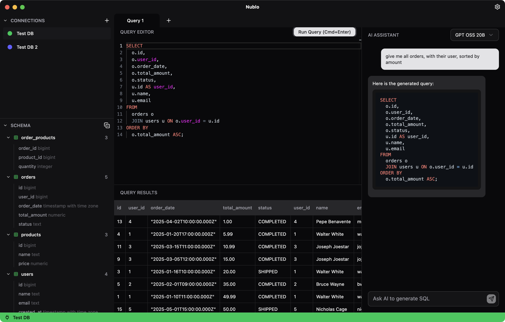

# Nublo

Nublo is a cross-platform DB tool that combines traditional database management capabilities, assisted by AI. Built with Electron, React, TypeScript, TailwindCSS, and Shadcn UI.

It provides a modern, intuitive interface for connecting to PostgreSQL databases, exploring schemas, writing SQL queries, and leveraging AI to generate queries from natural language prompts and the DB schema.

## Supported providers

For the moment, it supports connecting to these cloud providers by setting your API Keys:

- **OpenAI**
- **Google AI**
- **Anthropic**
- **OpenRouter**

On top of that, you can hook your local **Ollama** models by setting the url.
